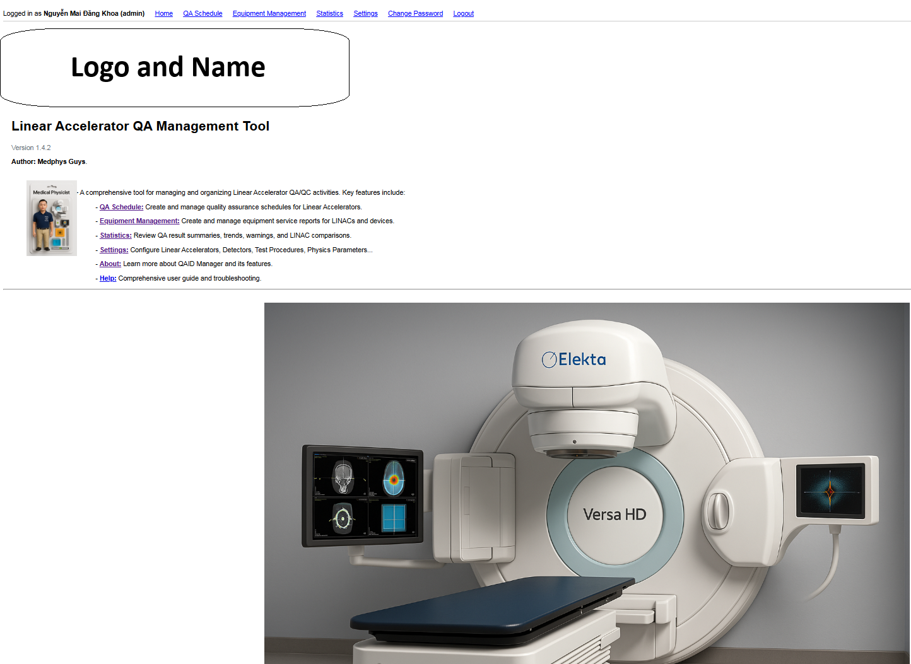
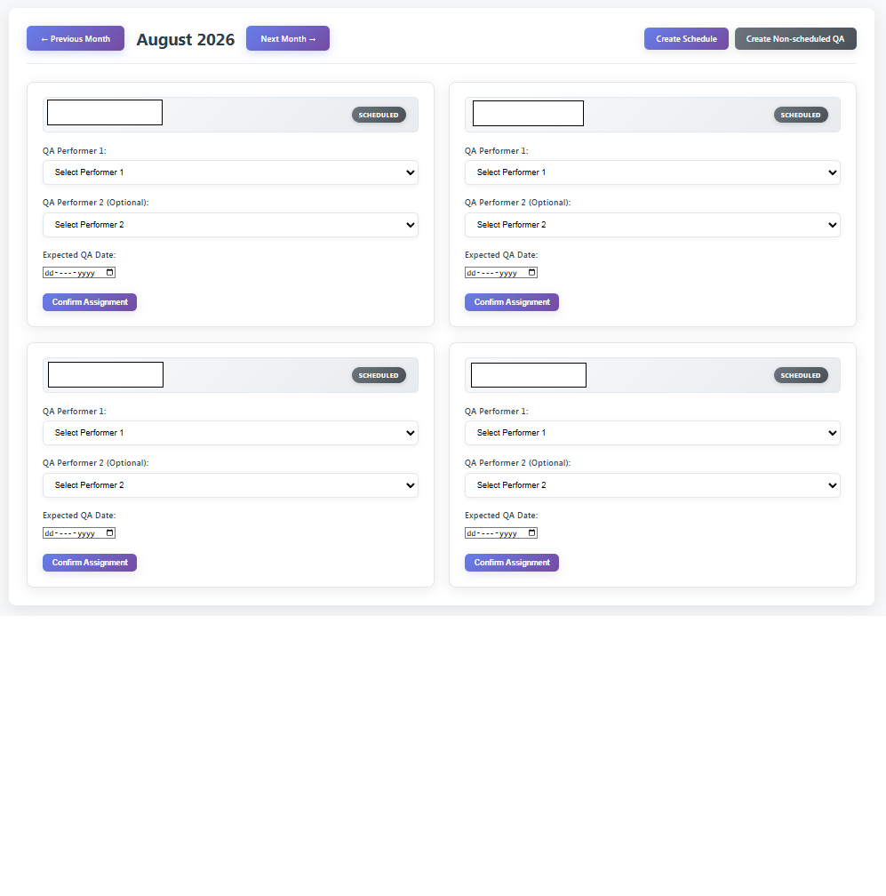
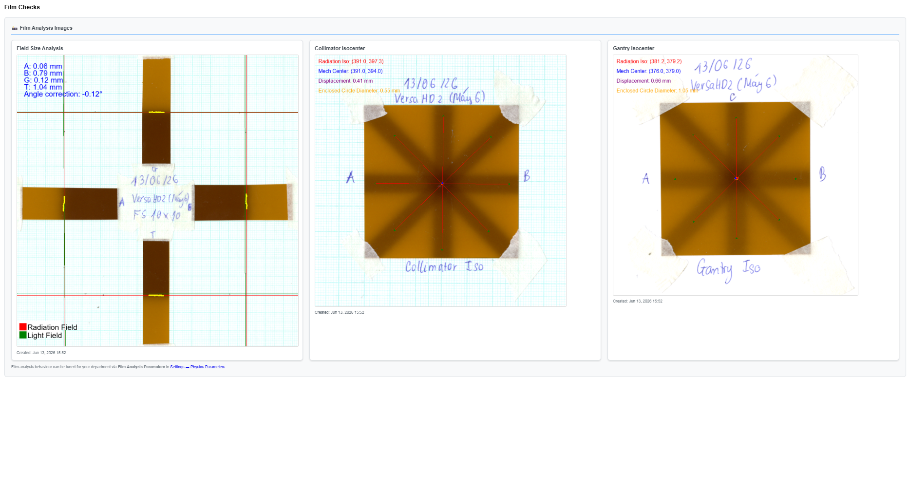
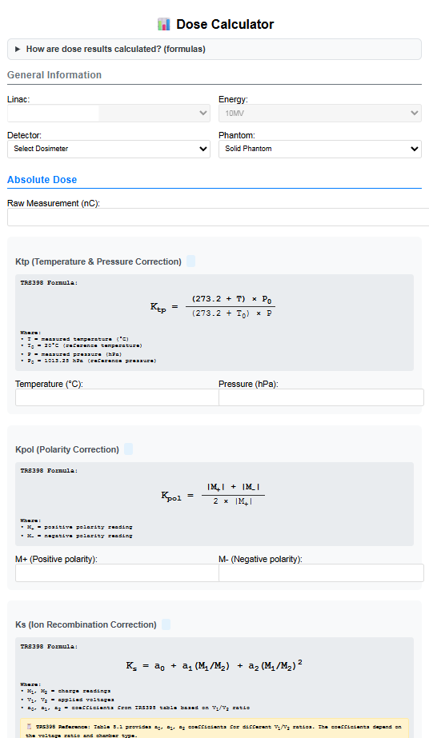
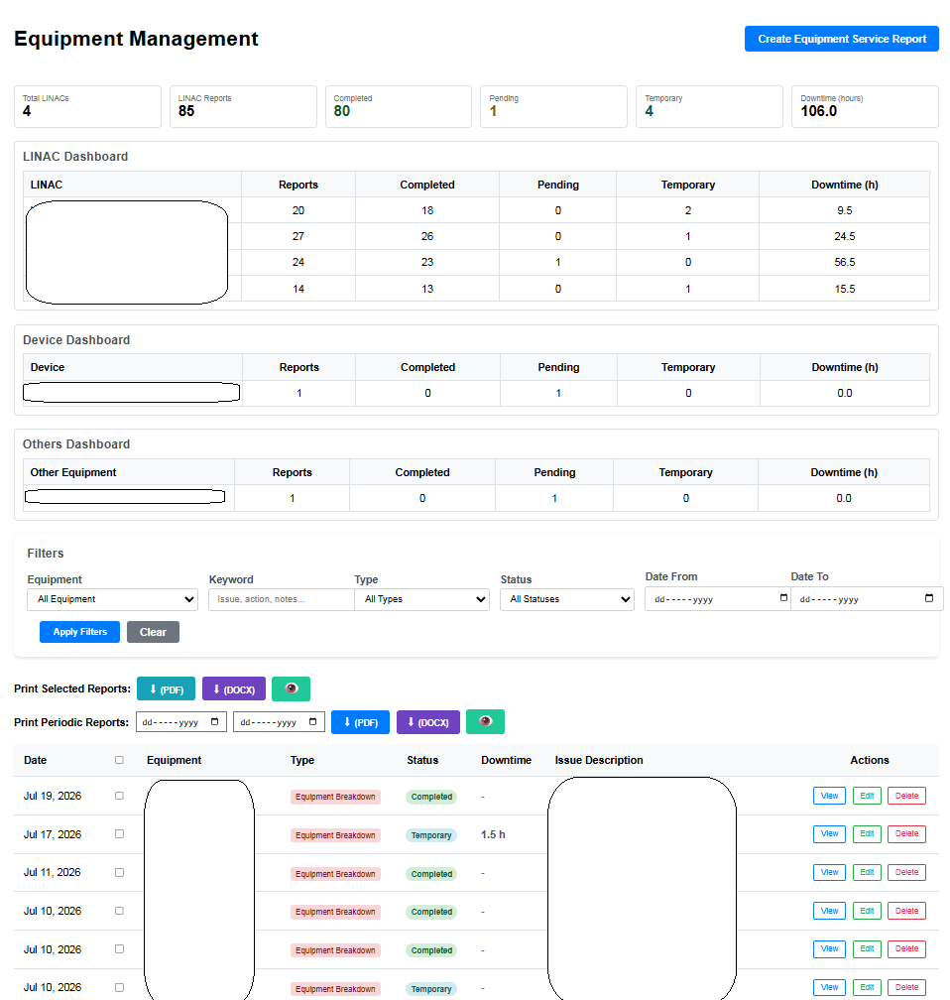
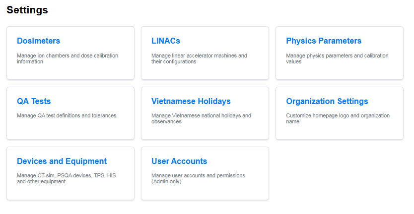

# Demo Walkthrough

## Purpose

This walkthrough demonstrates the LINAC QA Automation Prototype using **synthetic demo data only**. It is intended for GitHub viewers and reviewers who want to understand the application flow without necessarily installing or running the project.

The prototype is a **research/educational tool**. It is not clinically validated, not a medical device, and must not be used for clinical QA release decisions.

## Prerequisites

If you want to follow along interactively (optional — the screenshots below show each step):

1. Clone the repository.
2. Create a virtual environment and install dependencies (`requirements.txt` + `requirements-dev.txt`).
3. Copy `.env.example` to `.env` and set `DJANGO_SECRET_KEY`.
4. Run `python manage.py migrate` and `python scripts/init_demo_db.py`.
5. Start the server with `python manage.py runserver`.
6. Log in with `demo_admin` / `change-me-before-use`.

---

## Step 1 — Homepage



The homepage serves as the central dashboard. From here you can navigate to every major module: QA Schedule, Equipment Management, Statistics, Settings, Help, and About.

The organization name, logo area, and feature summary are all configurable through Settings. In the demo environment these show synthetic placeholder content.

---

## Step 2 — QA Schedule



The QA Schedule view manages monthly and ad-hoc QA planning. Each card represents one LINAC's scheduled QA session for the displayed month.

Key capabilities:

- Assign one or two QA performers per session.
- Set expected QA dates and track workflow status (Scheduled → In Progress → Completed → Passed/Failed).
- Create bulk monthly schedules or individual non-scheduled QA sessions.
- Navigate between months to review historical and upcoming QA commitments.
- Failed tests can be documented, accepted with justification, or escalated.

Structured scheduling with status tracking replaces informal paper/spreadsheet-based task assignment that is common in many radiotherapy departments.

---

## Step 3 — Film Analysis



The Film Analysis panel shows results from three film-based geometric checks:

1. **Field-size mismatch estimation** — compares light-field and radiation-field edges using a grayscale/image-intensity heuristic. Reports per-side shifts (A, B, G, T) in millimetres with automatic axis-rotation correction.
2. **Collimator star-shot-style geometric analysis** — detects radiation spoke bands along a user-defined circle, pairs opposite spokes, and computes a minimum enclosing circle to estimate displacement from the mechanical centre.
3. **Gantry star-shot-style geometric analysis** — uses the same radial-profile pipeline to assess gantry rotation consistency.

Important caveats:

- This is **not** OD-calibrated Gafchromic dose conversion. Analysis operates on grayscale pixel intensity only.
- Results depend on correct DPI metadata, adequate film contrast, and accurate user-guided geometry (lines for field size; centre and radius for star-shots).
- Analysis parameters (detection threshold, sampling band width) are configurable in Settings → Physics Parameters.
- Formal phantom validation is planned but not yet completed.

---

## Step 4 — TRS-398-Oriented Dose Calculator



The Dose Calculator provides an educational/prototype workflow for TRS-398-style absolute dosimetry calculations. It applies:

- Temperature–pressure correction (K_tp)
- Polarity correction (K_pol)
- Ion recombination correction (K_s) with coefficients from TRS-398 Table 8.1-style lookup
- Corrected charge (M_Q), beam quality (TPR_20,10), and absorbed dose at reference depth (D_w,Q)
- Relative dose checks: symmetry, flatness, output factor, wedge factor, MU linearity

Formula references are displayed inline so each calculation step can be verified. Results compare against stored commissioning (CAT) baselines per LINAC and energy.

**This is not a substitute for independent dosimetry worksheets or accredited clinical software.** Independent verification is mandatory before any professional reliance on numerical results.

---

## Step 5 — Equipment Management



The Equipment Management module tracks LINACs, ancillary devices, and service history:

- Dashboard cards summarize total reports, completion status, and cumulative downtime.
- Service reports capture issues, actions, status, and downtime hours.
- Filtering by equipment, type, status, keyword, and date range supports audit review.
- Batch PDF/DOCX export for periodic reporting.

---

## Step 6 — Settings and Configuration



The Settings page provides centralized configuration for the QA workflow:

- **Dosimeters / LINACs / Devices** — hardware inventory and reference data.
- **Physics Parameters** — Ks coefficients, kQ tables, film analysis parameters.
- **QA Tests** — test names, types (mechanical / beam / film / isocenter), tolerances, and units.
- **User Accounts** — role-based access (administrator, medical physicist, radiation therapist).
- **Organization Settings** — homepage branding and report templates.
- **Holidays** — scheduling calendar adjustments.

Configurable tolerances and physics parameters allow the prototype to adapt to different departmental protocols without code changes.

---

## Step 7 — Run Synthetic Regression Tests

From the repository root:

```bash
python -m pytest tests -q
```

Expected output: all synthetic tests pass. These cover:

- TRS-398-style dose formula correctness (Ktp, Kpol, Ks, MQ, TPR, kQ interpolation)
- Field-size edge detection on synthetic images against known ground truth
- Star-shot displacement and enclosing-circle diameter on synthetic spoke images

---

## Interpretation

### What this demo demonstrates

- **Workflow design** — structured scheduling, documentation, and status tracking for monthly LINAC QA.
- **QA informatics** — centralized data model linking machines, tests, records, schedules, and reports.
- **Image-analysis prototyping** — film-based geometric heuristics for field-size and star-shot-style checks.
- **Dose workflow encoding** — TRS-398-oriented correction chain with inline formula references.
- **Synthetic validation testing** — regression tests against known-geometry images and analytic dose formula expectations.
- **Non-clinical transparency** — explicit disclaimers, limitations, and AI-assisted development disclosure.

### What this demo does not demonstrate

- **Clinical accuracy** — no formal phantom or clinical validation has been completed.
- **Phantom validation** — planned but not yet performed (see `docs/validation-plan.md`).
- **Commercial software equivalence** — this is a research prototype, not a replacement for validated clinical tools.
- **Patient-safety readiness** — the system has not undergone IQ/OQ/PQ or institutional approval processes.
- **Clinical release approval** — do not use this prototype as the sole basis for releasing a LINAC for clinical treatment.
